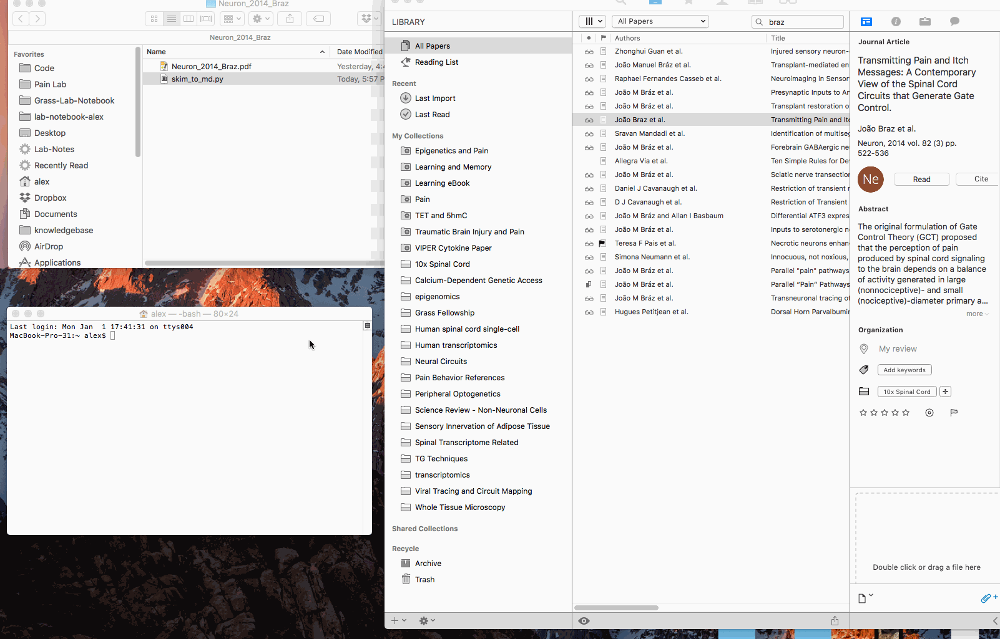

# skim_to_md

This is a script in python that takes highlighted text from a PDF in [Skim.app](https://sourceforge.net/projects/skim-app) and produces individual markdown files for each highlight. 

[Current release](https://github.com/achamess/skim_to_md_script/releases)

You can use either, but it's probably easiest to use the shell script. 

## What it does

- Export highlights from a PDF annotated in Skim.app
- Converts each highlight into a single Markdown-formatted file 
- Names each file uniquely 

This is a work in progress and eventually, I hope to add additional features.

In addition to the highlighted text, the output files have other fields, including:
- Title
- Tags
- Reference citation
- Citekey: For reference managers such as Papers3.app, Zotero, Bibdesk...
- Summary
- Comments

These bits of info are usually what one needs to have at hand for producing some kind of writing or scholarly output. Kind of like old school index-cards were used for research once upon a time.



## Usage

From the command line, navigate to the folder that contains the PDF of interest.
	
``` bash
	cd /path/to/folder #where the PDF is
	sudo chmod u+x skim_to_md.sh #make executable
	skim_to_md.sh #run the script

```

Note: If you put the script file in the same folder as the PDF, you don't need to do anything but run it as shown. But if you want to run it from anywhere, modify your `$PATH` to the directory where you keep the `skim_to_md.sh` script. 

## Who's it for?

Anyone who does work wtih texts - academics, journalists, writers, researchers, etc.

## Requirements
- [skimnotes - command line tool for Skim.app](https://sourceforge.net/projects/skim-app/files/SkimNotes%20framework%20and%20tool/)
- [Skim.app](https://sourceforge.net/projects/skim-app)

## Roadmap

- Make more templates that are external to the script
- Allow for more filtering of the quoted text
- Integrate tags 
