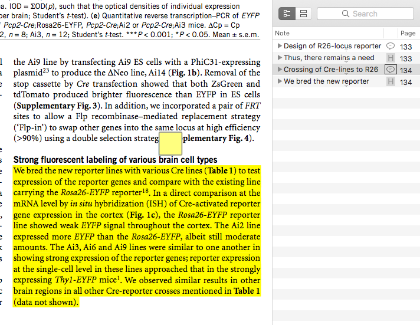

# skim_to_md

This is a script in python that takes highlighted text from a PDF in [Skim.app](https://sourceforge.net/projects/skim-app) and produces individual markdown files for each highlight. 

[Current release](https://github.com/achamess/skim_to_md_script/releases)

You can use either, but it's probably easiest to use the shell script. 

## Requirements
- [skimnotes - command line tool for Skim.app](https://sourceforge.net/projects/skim-app/files/SkimNotes%20framework%20and%20tool/)
- [Skim.app](https://sourceforge.net/projects/skim-app)
- Papers3.app


## What it does

- Export highlights from a PDF annotated in Skim.app
- Converts each highlight into a single Markdown-formatted file 
- Names each file with unique ID and also a summary one-liner

## Usage

Papers3.app integration

The PDF that you're anotating *MUST* have a record in your Papers3.app. If not, the script will fail.

Highlight format

- The script requires that you highlight in pairs. For every highlight in your PDF, you must also make an anchored note that is your summary of the highlight. This is important because the extracted Markdown file will get its name based on the summary. If you do not do this, the files cannot be named. Thus, at the time of using this script, your PDF must have an *even number* of annotations.
- Also, the anchored note must come immediately before the highlight of interest. This is how the summary and highlight get paired.

Before using the script, you must make some modifications specific to your filesystem:

`path_to_zk = "path/to/your/notes"`
You must change this variable to the full path to wherever you want your notes to go. 



``` bash
	cd /path/to/skim_to_md_folder
	sudo chmod u+x skim_to_md.sh #make executable
	sudo chmod u+x get_paper.sh
	skim_to_md.sh [tag1,tag2,tag3 - optional] #run the script

```

Note: If you put the script file in the same folder as the PDF, you don't need to do anything but run it as shown. But if you want to run it from anywhere, modify your `$PATH` to the directory where you keep the `skim_to_md.sh` script. 

## Who's it for?

Anyone who does work wtih texts - academics, journalists, writers, researchers, etc.


## Roadmap

- More templates
- Tagging updates

## Release Notes

### v0.2
- Many new features:
	- Integration of Papers3.app and Skim.app. All metadata now are taken directly from these apps. No manual input is necessary.
	- Tagging: Currently, the script can take one optional argument, which is a comma-list of tags. 
	- Automatic directory creation: Creates a target directory for your notes.
	- Additive extraction: Previously, the script would overwrite any notes that had already been extracted. Now, it looks at the target directory and searches to see if any current notes match any of the current highlights. It does not overwrite them. So now you can return to a PDF and add more highlights at a later point and not overwrite your previous highlights.


